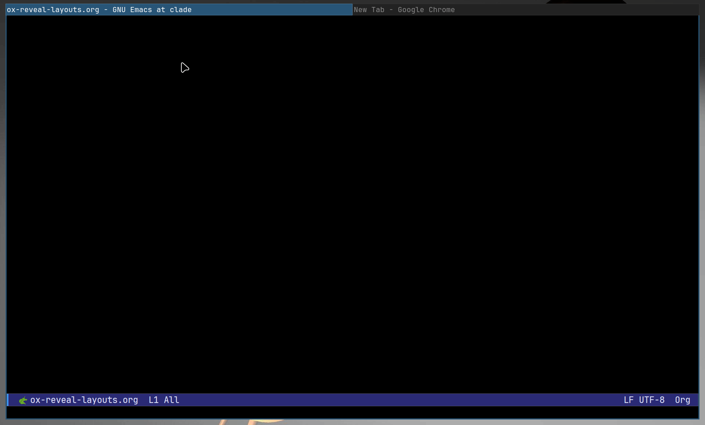
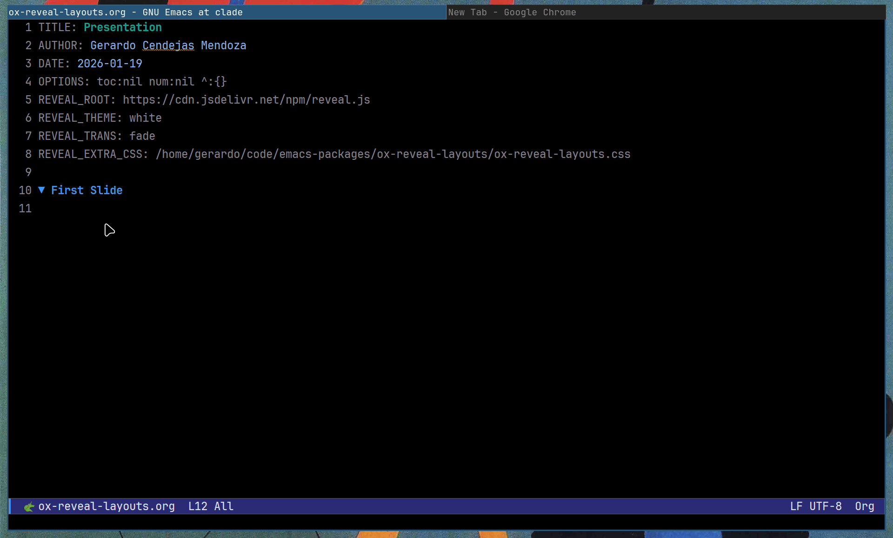
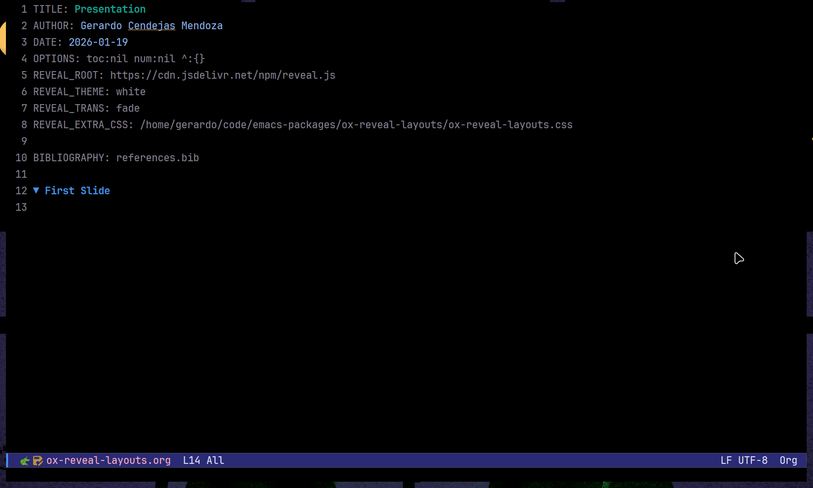

# ox-reveal-layouts

[](https://www.gnu.org/licenses/gpl-3.0)




**Table of Contents**

- [Why this package?](#why-this-package)
- [Installation](#installation)
- [Usage](#usage)
- [Features ✨](#features-)
- [Customization](#customization)
- [License](#license)

**ox-reveal-layouts** is an extension for [ox-reveal](https://github.com/yjwen/org-reveal.git) that adds a visual, interactive menu to insert complex 2D layouts (Grids, Split Columns, Floating Images) into your presentation.

It solves the main pain point of creating slides in Org Mode: **positioning content side-by-side or in grids without writing messy HTML/CSS manually.**

Designed for scientists, developers, and academics who need their slides to look professional but want to write them at the speed of Emacs.

> **Note:** This package requires `ox-reveal` to be installed.

---

## Why this package?

If you have ever tried to put 4 images in a grid or place text next to an image in `ox-reveal`, you know you usually have to write raw HTML `<div>` blocks and manage your own CSS.

**ox-reveal-layouts** automates this. You press a key, select your files, and the package writes the necessary Org/HTML structure for you, injecting a robust CSS stylesheet automatically.

## Installation

### From Source

**ox-reveal-layouts** is not yet on MELPA. You can install it by cloning the repo:

#### 1. Clone the repo

```bash
git clone https://github.com/GerardoCendejas/ox-reveal-layouts.git
```

### 2. Emacs config (use-package)

Add this to your `init.el` or Emacs config file:

```elisp
(use-package ox-reveal-layouts
  :load-path "~/path/to/ox-reveal-layouts/" ; Point to where you cloned it
  :after (ox-reveal)
  :bind (("C-c r l" . ox-reveal-layouts-menu))    ; Recommended binding
  :config
  ;; Optional: Set your local reveal.js path if you don't want to use the CDN
  ;; (setq orl-reveal-root-path "file:///home/yourname/.emacs.d/reveal.js")
  
  (message "Ox-Reveal-Layouts loaded!"))
```

## Usage

### 1. Start a new presentation

Run the menu with `C-c r l` (or your bound key) and press `n` (New Presentation Template). This will create a buffer with all the necessary headers, including the CSS Injection required for the layouts to work.

### 2. Insert Layouts

Inside any slide, call the menu (`C-c r l`) and choose a layout:

Image Layouts:

- Centered Image (`i`): Prompts for a single image file and centers it on the slide.
- Grid 4 Images (`g`): Prompts for 4 image files and creates a perfect 2x2 grid.
- Two Images (`s`): Places two images side-by-side.
- Vertical stack (`k`): Places two images stacked vertically.

Text/Image Layouts:

- Split Layouts (`l` / `r`): Creates a 50/50 column layout (Text/Image or Image/Text). You can write standard Org Mode syntax (lists, bold, etc.) inside the text area.
- Text (Up)/ Image (Down) (`v`): Places text above an image.

Floating Images:

- Pins/Stickers (`p`): Insert images that float over the slide content. You can specify position (Top-Left, Top-Right, Bottom-Left, Bottom-Right or custom).



## Features ✨

### Citations and Footnotes

You can add citations as footnotes for the slides with `c` in the menu. This will insert a properly formatted footnote at the bottom of the slide. It supports organic Org-mode citations, works as standard org.

### --caption Support

When inserting images, you can add captions by using the `-c`/`--caption` flag before inserting a layout with images. This will render a caption below the image in the slide.



### Key Features

- Zero Config: Works out-of-the-box using a CDN for reveal.js.
- Visual Interface: Uses Emacs `Transient` menus (like Magit) for a learning-free experience.
- Smart CSS: The included stylesheet handles responsiveness. Images fit their containers automatically (`object-fit: contain`).
- Org-Native: Text areas in Split Layouts support full Org-mode syntax (tables, code blocks, lists).
- Stickers: Easily pin floating images to corners.

## Customization

You can customize the behavior via `M-x customize-group ox-reveal-layouts`.

`ox-reveal-layouts-reveal-root-path`: By default, it uses the JSDelivr CDN. Change this string to point to your local `reveal.js` folder for offline use.

`ox-reveal-layouts-title-slide-template`: String containing HTML for your title slide (useful for adding custom logos or branding to the first slide).

## License

GPLv3